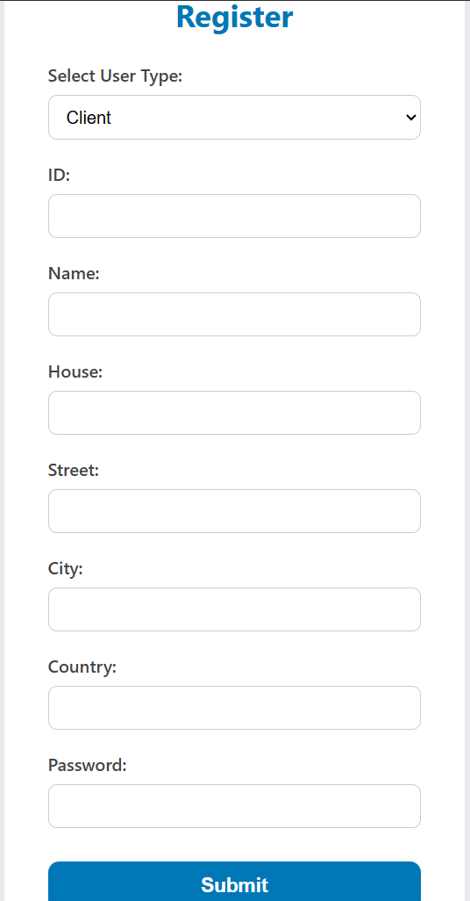

# ServiceHub


**ServiceHub** is a service management web application that connects **Clients** and **Service Providers**. Clients can register, search for providers by name or service type, request services, and track bookings. Providers can manage bookings and update their profiles.

---

## Features

-  User authentication with **bcryptjs** and **express-session**
-  Client & Provider registration and login
-  Search service providers by name and service
-  Book services and view bookings
-  Update and delete user profiles
-  Simple front-end using EJS templates
-  Data persistence with MySQL

---

## ⚙️ Technologies Used

- **Node.js**
- **Express.js**
- **MySQL**
- **EJS** (Embedded JavaScript templates)
- **bcryptjs** for password hashing
- **express-session** for session handling
- **body-parser** for parsing POST data
- **nodemon** for development


## Installation

1. **Clone the Repository:**

   ```bash
   git clone https://github.com/yourusername/servicehub.git
   cd servicehub
    ````

2. **Install Dependencies:**

   ```bash
   npm install
   ```

3. **Configure Database:**

   Create a MySQL database with the following schema:

   ```sql
   CREATE DATABASE servicehub;

   USE servicehub;

   CREATE TABLE client (
       c_id VARCHAR(50) PRIMARY KEY,
       c_name VARCHAR(100),
       password VARCHAR(255),
       house VARCHAR(100),
       street VARCHAR(100),
       city VARCHAR(50),
       country VARCHAR(50)
   );

   CREATE TABLE provider (
       p_id VARCHAR(50) PRIMARY KEY,
       p_name VARCHAR(100),
       password VARCHAR(255),
       house VARCHAR(100),
       street VARCHAR(100),
       city VARCHAR(50),
       country VARCHAR(50),
       service VARCHAR(100)
   );

   CREATE TABLE service (
       service_id INT AUTO_INCREMENT PRIMARY KEY,
       service_name VARCHAR(100),
       p_id VARCHAR(50),
       c_id VARCHAR(50),
       FOREIGN KEY (p_id) REFERENCES provider(p_id),
       FOREIGN KEY (c_id) REFERENCES client(c_id)
   );
   ```

4. **Configure Connection:**

   Modify `connection.js` with your MySQL credentials:

   ```js
   const mysql = require('mysql');
   const con = mysql.createConnection({
       host: 'localhost',
       user: 'your_username',
       password: 'your_password',
       database: 'servicehub'
   });
   module.exports = con;
   ```

5. **Run the Application:**

   ```bash
   nodemon start
   ```

6. Visit [`http://localhost:7000`](http://localhost:7000) in your browser.

---

##  Key Routes

| Method | Route                    | Description                      |
| ------ | ------------------------ | -------------------------------- |
| GET    | `/`                      | Login page                       |
| POST   | `/`                      | Login authentication             |
| GET    | `/register`              | Registration form                |
| POST   | `/register`              | Register a client or provider    |
| GET    | `/client`                | Admin view for all clients       |
| GET    | `/provider`              | Admin view for all providers     |
| GET    | `/search-service`        | View all providers (search page) |
| GET    | `/search`                | Search providers by name/service |
| GET    | `/request-service`       | Book a service                   |
| GET    | `/client-booking`        | View client's booked services    |
| GET    | `/view-booking`          | View bookings made to a provider |
| GET    | `/view-accepted-booking` | View accepted bookings           |
| GET    | `/update-client`         | Get update form for a client     |
| POST   | `/update-client`         | Submit updated client info       |
| GET    | `/update-provider`       | Get update form for a provider   |
| POST   | `/update-provider`       | Submit updated provider info     |
| GET    | `/delete-client`         | Delete a client by ID            |
| GET    | `/delete-provider`       | Delete a provider by ID          |
| GET    | `/logout`                | Logout user and destroy session  |
| GET    | `/error`                 | Display error messages           |

---

##  Session & Security

* User sessions are handled using `express-session`
* Passwords are hashed with `bcryptjs` before storing
* Session variables track the logged-in user type (`client` or `provider`)
---


## System Diagram


---
## Some Screenshots




---


